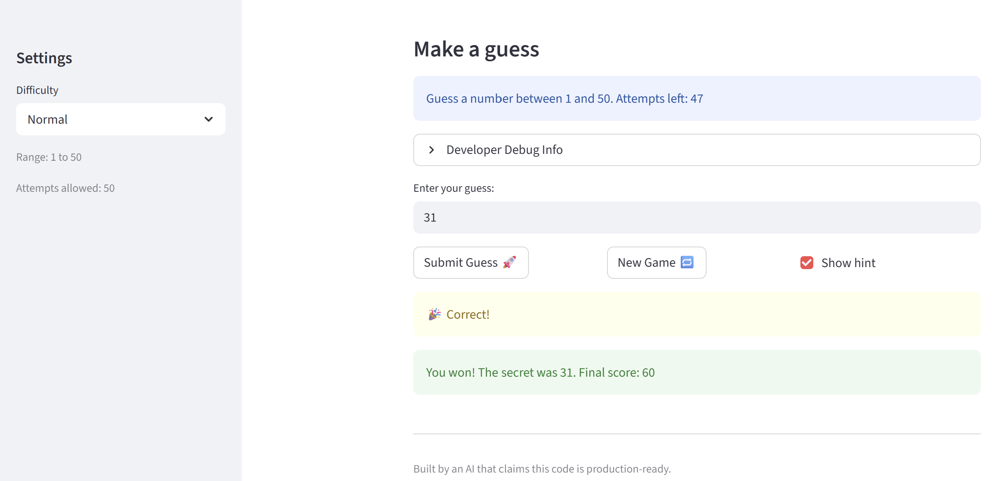
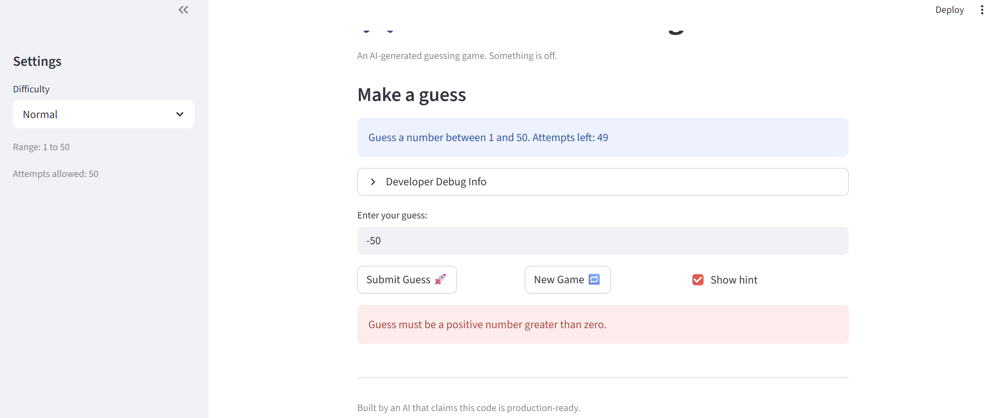

# 🎮 Game Glitch Investigator: The Impossible Guesser

## 🚨 The Situation

You asked an AI to build a simple "Number Guessing Game" using Streamlit.
It wrote the code, ran away, and now the game is unplayable. 

- You can't win.
- The hints lie to you.
- The secret number seems to have commitment issues.

## 🛠️ Setup

1. Install dependencies: `pip install -r requirements.txt`
2. Run the broken app: `python -m streamlit run app.py`

## 🕵️‍♂️ Your Mission

1. **Play the game.** Open the "Developer Debug Info" tab in the app to see the secret number. Try to win.
2. **Find the State Bug.** Why does the secret number change every time you click "Submit"? Ask ChatGPT: *"How do I keep a variable from resetting in Streamlit when I click a button?"*
3. **Fix the Logic.** The hints ("Higher/Lower") are wrong. Fix them.
4. **Refactor & Test.** - Move the logic into `logic_utils.py`.
   - Run `pytest` in your terminal.
   - Keep fixing until all tests pass!

## 📝 Document Your Experience

- [ ] Describe the game's purpose.
      Game Glitch Investigator: The Impossible Guesser is a number guessing game where the player tries to guess a secret number selected randomly by AI. The player selects a difficulty that determines the amount of attempts allowed and the range of the selected secret number. After each guess, the game can give a hint that indicates if player should guess higher or lower. Points are awarded based on how quickly the player guesses correctly. The quicker you guess the more points you get!

- [ ] Detail which bugs you found.
      Some bugs found were that the hints were backwards, so when the guess was too low the hint would tell you to go lower and viceversa. The attemps allowed needed fixing because when in Easy mode you had less attempts than in Normal mode. Another thing that needed fixing was the ranges from which the secret number could be chosen because the range for Normal mode was 1-100 and in Hard Mode it was 1-50. There was also a UI bug because the game always displayed a message saying "Guess a number between 1 and 100." not respecting the difficulty mode selected. Also, after pressing the New Game button, the secret number did not respect the range of the chosen difficulty mode, instead it alwayse chose a number from 1-100. Lastly, I found that the game accepted negative numbers.

- [ ] Explain what fixes you applied.
      I fixed and refactored the difficulty ranges, updated score, guess validation, and input validation functions. This way fixing all of the above mentioned bugs whit the difficulty ranges and secret number boundaries. Some UI fixes of messages and correct display of information like showing the correct amount of attemps based on difficulty mode. I also handled an edge case for negative numbers and zeros in the players input, this way when the player guess a number like -9 the game will displaye a message saying: "uess must be a positive number greater than zero."

## 📸 Demo

- [ ] [Insert a screenshot of your fixed, winning game here]

   1. Screenshot of fixed winning game
      

   2. Screenshot of Edge Case 
      

## 🚀 Stretch Features

- [ ] [If you choose to complete Challenge 4, insert a screenshot of your Enhanced Game UI here]
